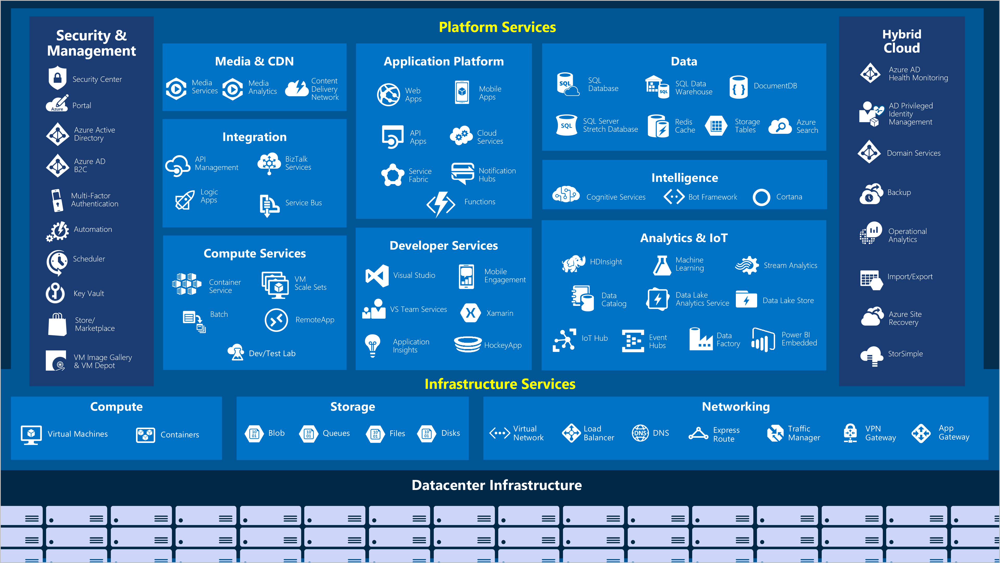

# Guia Geral

---

## 1. Introdução  

A certificação AZ-900: Microsoft Azure Fundamentals é o primeiro passo para profissionais interessados em adquirir conhecimentos básicos sobre a nuvem Microsoft Azure. 

É ideal para quem deseja entender os conceitos de computação em nuvem, os principais serviços do Azure e como eles se aplicam a cenários de negócios e técnicos.  

Esta documentação oferece uma visão abrangente sobre os tópicos abordados na prova, servindo como guia de estudo para candidatos.  

---

## 2. Objetivo  

O objetivo desta documentação é fornecer um resumo estruturado dos tópicos tratados no exame AZ-900, auxiliando os candidatos na preparação e aumentando sua compreensão dos conceitos fundamentais.  

Especificamente, visa:  
- Explicar os fundamentos da computação em nuvem.  
- Detalhar os serviços principais do Azure.  
- Abordar a segurança, compliance, preços e suporte.  

---

## 3. Público-alvo  

- Profissionais de tecnologia iniciantes na computação em nuvem.  
- Estudantes ou profissionais interessados em entender os serviços Azure.  
- Gestores e tomadores de decisão que desejam avaliar os benefícios da nuvem.  
- Qualquer pessoa interessada em obter a certificação AZ-900 como base para estudos futuros em Azure.  

---

## 4. Conteúdo  

### 4.1. Fundamentos de Computação em Nuvem  

#### 4.1.1. Conceitos Básicos  

  - Definição de computação em nuvem.  
  - Vantagens da nuvem (escalabilidade, elasticidade, agilidade).  
  - Tipos de nuvem: Pública, Privada, Híbrida.  
  - Modelos de serviço: IaaS, PaaS, SaaS.  

#### 4.1.2. Conceitos Básicos  
  - Modernização de aplicativos.  
  - Redução de custos operacionais.  

### 4.2. Introdução aos Principais Serviços do Azure  

#### 4.2.1. Cálculo (Compute)  
  - Máquinas Virtuais (VMs).  
  - Azure App Services.  
  - Kubernetes e Containers.  

#### 4.2.2. Armazenamento (Storage) 
  - Blobs, Tables e Files.  
  - Azure Disk Storage.  

#### 4.2.3. Rede (Networking)
  - Rede Virtual (VNet).  
  - Balanceadores de carga e Gateways.  

### 4.3. Segurança e Gerenciamento de Identidade  
- Princípios de segurança em nuvem.  
- Azure Active Directory (Azure AD).  
- Controle de acesso baseado em função (RBAC).  
- Ferramentas de monitoramento e auditoria.  

### 4.4. Gerenciamento de Recursos e Governança  
- Grupos de Recursos.  
- Azure Policy.  
- Locks e Blueprints.  

### 4.5. Preços e Suporte  
- Fatores que afetam custos.  
- Calculadora de preços do Azure.  
- Níveis de suporte disponíveis.  

---

## 5. Guia de Uso
### 5.1. Planeje sua Jornada de Estudo
   - Use o [Microsoft Learn](https://learn.microsoft.com/) como principal recurso gratuito.  
   - Reserve 1-2 semanas para revisar cada módulo.  

### 5.2. Pratique com Cenários Reais

Experimente serviços no portal Azure usando uma conta gratuita.  

### 5.3. Realize Simulados

Teste seus conhecimentos com simulados disponíveis online.  

### 5.4. Revisão Focada

Concentre-se em tópicos onde identificar maior dificuldade.  

!!! Tip "Dica"
    Utilize laboratórios práticos do Azure para consolidar seu aprendizado.  

---

## 6. Referências  
- Documentação Oficial Azure: [https://docs.microsoft.com/en-us/azure](https://docs.microsoft.com/en-us/azure)  
- Exemplo de Exame: [https://www.microsoft.com/learning/exam-az-900](https://www.microsoft.com/learning/exam-az-900)  
- Calculadora de Preços Azure: [https://azure.microsoft.com/pricing](https://azure.microsoft.com/pricing)  

---

## 7. Anexos  
### 7.1. Tabela de Tópicos por Área  
| Área                   | Tópicos principais                           | Peso aproximado no exame |
| ---------------------- | -------------------------------------------- | :----------------------: |
| Fundamentos de nuvem   | Modelos de serviço, benefícios, conceitos    |          15-20%          |
| Serviços principais    | Compute, Storage, Networking                 |          30-35%          |
| Segurança e Identidade | Azure AD, RBAC, ferramentas de monitoramento |          20-25%          |
| Governança e Custos    | Azure Policy, custos, suporte                |          20-25%          |

### 7.2. Esquema Visual de Serviços Azure

Diagrama dos serviços oferecidos no Azure e suas interações.  

--- 

Se precisar de mais detalhes sobre algum módulo, posso detalhar. Como posso ajudar?