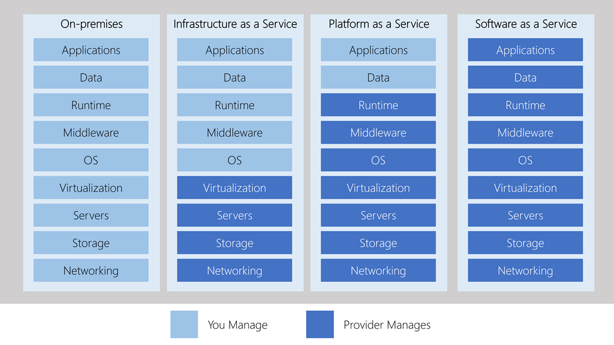
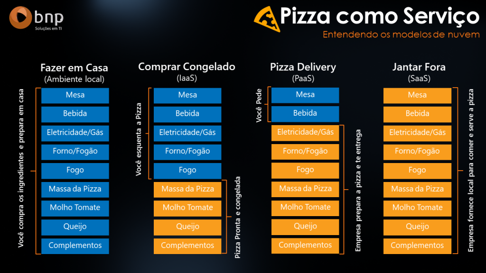

# Tipos de Serviço de Nuvem

## 1. IaaS (Infraestrutura como Serviço)

### 1.1. Descrição

IaaS fornece recursos de computação virtualizados pela internet. Inclui servidores, armazenamento e redes, onde os usuários têm controle sobre sistemas operacionais e aplicações, enquanto o provedor gerencia a infraestrutura física.

### 1.2. Casos de Uso Apropriados

- **Desenvolvimento e teste:** IaaS oferece um ambiente flexível e econômico para desenvolvimento e teste de aplicações.
- **Armazenamento e backup:** Soluções de armazenamento escaláveis e backup são ideais para empresas que precisam de capacidades flexíveis e seguras.
- **Recuperação de desastres:** Implementação de soluções de recuperação de desastres devido à sua flexibilidade e custo-benefício.
- **Websites de alta demanda:** Hospedagem de websites que exigem customização de hardware e software.

!!! tip "Dica para IaaS" 
    Utilize IaaS para experimentar rapidamente novas ideias com um custo inicial baixo, pagando apenas pelo que você realmente utiliza.

## 2. PaaS (Plataforma como Serviço)

### 2.1. Descrição

PaaS oferece aos desenvolvedores um ambiente de desenvolvimento completo na nuvem, incluindo hardware, software e ferramentas de desenvolvimento. 

Os usuários gerenciam aplicações e dados, enquanto o provedor cuida da infraestrutura, sistemas operacionais e middleware.

### 2.2. Casos de Uso Apropriados

- **Desenvolvimento de aplicações:** PaaS proporciona um ambiente robusto e integrado para desenvolver, testar e implantar aplicações sem se preocupar com a manutenção de infraestrutura.
- **Análise de dados:** Plataformas que oferecem capacidades analíticas integradas ajudam as empresas a extrair insights de grandes volumes de dados.
- **Aplicações IoT (Internet das Coisas):** Oferece ferramentas e capacidades que facilitam o desenvolvimento de aplicações IoT.

!!! tip "Dica para PaaS" 

    PaaS é ideal para desenvolvedores que querem se concentrar no desenvolvimento e gestão de suas aplicações sem se preocupar com o gerenciamento da infraestrutura.

## 3. SaaS (Software como Serviço)

### 3.1. Descrição

SaaS é um modelo de entrega de software em que aplicações são hospedadas por um provedor de serviços e disponibilizadas aos clientes pela internet, geralmente sob a forma de assinatura.

### 3.2. Casos de Uso Apropriados

- **Aplicações de produtividade empresarial:** Ferramentas como e-mail, calendário, processamento de texto e planilhas que são usadas por praticamente todos os funcionários.
- **Ferramentas de colaboração:** Plataformas de comunicação e colaboração que conectam equipes dispersas geograficamente.
- **Gestão de relacionamento com o cliente (CRM):** Softwares de CRM que ajudam empresas a gerenciar interações com clientes, suporte e vendas.
- **Softwares de recursos humanos (RH):** Sistemas para gerenciamento de recursos humanos, incluindo recrutamento, folha de pagamento e benefícios.

!!! tip "Dica para SaaS" 
    SaaS é perfeito para pequenas e médias empresas que buscam soluções de TI de baixo custo e alta eficiência sem a necessidade de gerenciar a tecnologia por conta própria.

