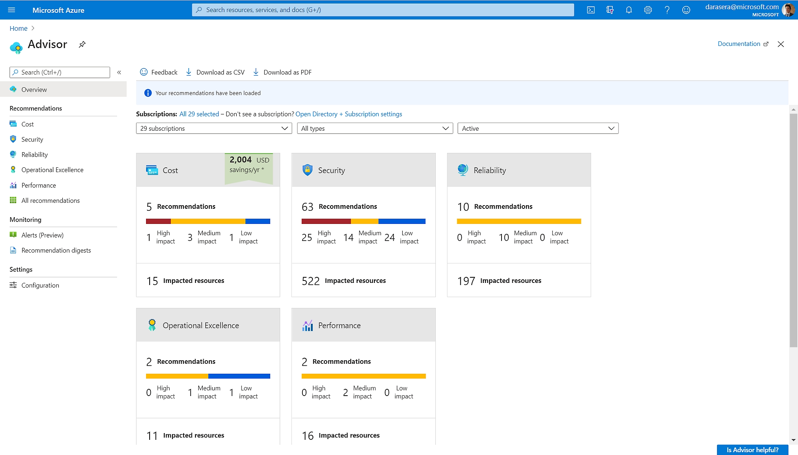
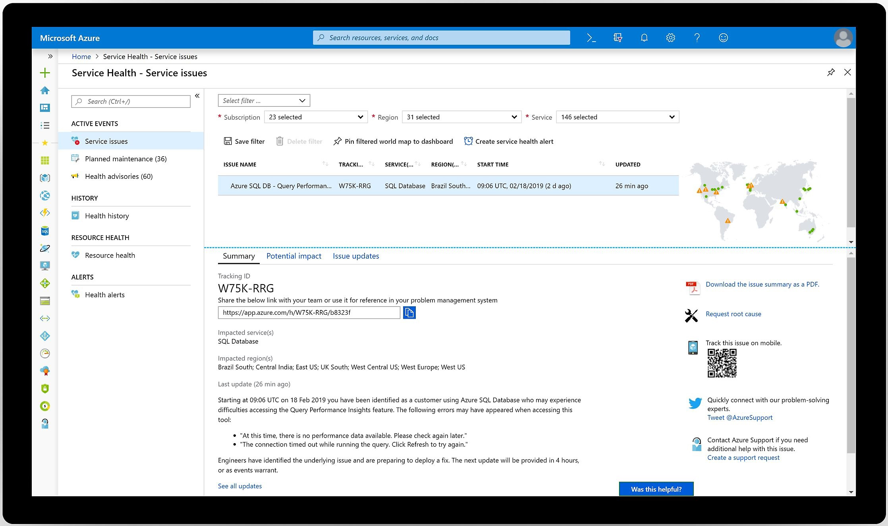
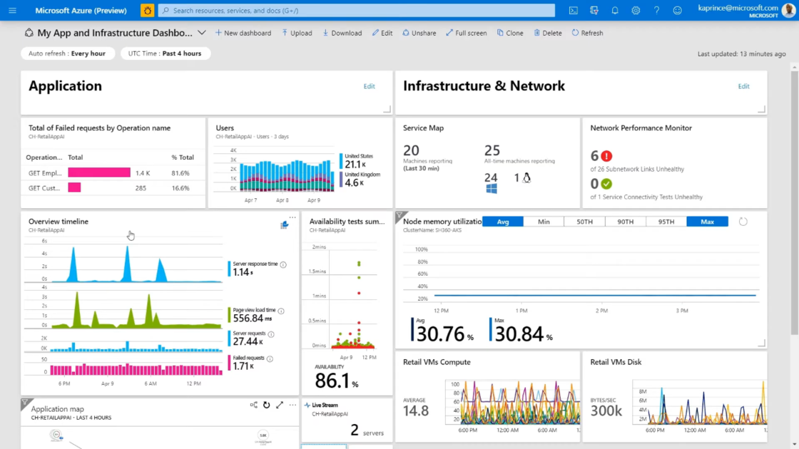
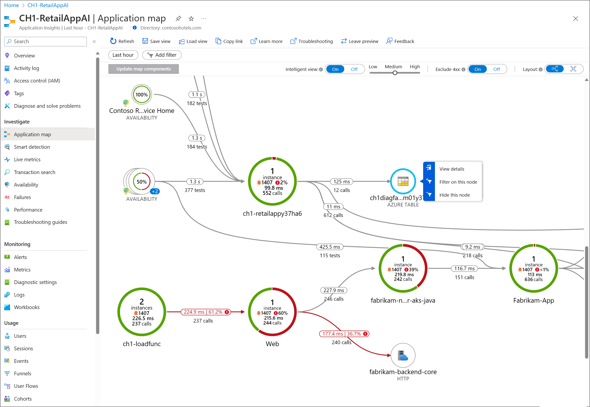

# Azure Monitoring Tools  

## 1. Azure Advisor  

O Azure Advisor é uma ferramenta de gerenciamento e otimização que fornece recomendações personalizadas para recursos do Azure. 

Baseando-se em padrões de uso e práticas recomendadas, o Advisor ajuda a melhorar a eficiência, otimizando performance, segurança e custos. 

Ele analisa a configuração dos serviços e sugere melhorias para garantir que os recursos estejam alinhados com as melhores práticas da Microsoft.

!!! tip "Dica"  
    Use o Azure Advisor regularmente para revisar recomendações de segurança e otimização de custos, garantindo um ambiente mais eficiente.

## 2. Azure Service Health  

O Azure Service Health fornece um painel em tempo real que mostra o estado atual dos serviços do Azure em todas as regiões. Essa ferramenta é essencial para identificar problemas de serviço que possam afetar seus recursos.  

Além disso, o Service Health oferece uma visão histórica de incidentes anteriores e manutenções planejadas, permitindo que os usuários recebam notificações personalizadas sobre eventos críticos que possam impactar sua infraestrutura no Azure.

!!! info "Info"  
    O Azure Service Health ajuda a antecipar e responder rapidamente a problemas de disponibilidade, evitando impactos críticos nas operações.

## 3. Azure Monitor  

O Azure Monitor é uma plataforma de monitoramento abrangente que coleta, analisa e atua sobre dados telemétricos dos ambientes Azure e on-premise. 

Ele permite entender a performance dos aplicativos e monitorar a saúde da infraestrutura em tempo real.

### 3.1. Log Analytics  

Parte do Azure Monitor, o Log Analytics coleta e analisa dados de logs de diversos recursos do Azure. Os usuários podem criar consultas detalhadas para gerar insights operacionais e diagnosticar problemas.

!!! tip "Dica"  
    Use Log Analytics para centralizar logs de diversos serviços e identificar padrões que possam indicar problemas antes que impactem o ambiente.

### 3.2. Azure Monitor Alerts  

Os Azure Monitor Alerts permitem configurar alertas personalizados baseados em métricas específicas ou logs de eventos. 

Quando um limite crítico é atingido, os administradores recebem notificações automáticas, ajudando na resolução rápida de problemas.

!!! warning "Atenção"  
    Configure Alertas Proativos para detectar anomalias antes que causem falhas graves, minimizando impactos nos serviços críticos.

### 3.3. Application Insights  

O Application Insights é um recurso do Azure Monitor focado no monitoramento de aplicações web. 

Ele coleta automaticamente dados de performance e exceções, fornecendo ferramentas para analisar a experiência do usuário e diagnosticar erros de aplicação.

!!! tip "Dica"  
    Utilize Application Insights para detectar problemas de desempenho antes que impactem seus usuários, garantindo uma experiência fluida e otimizada.
